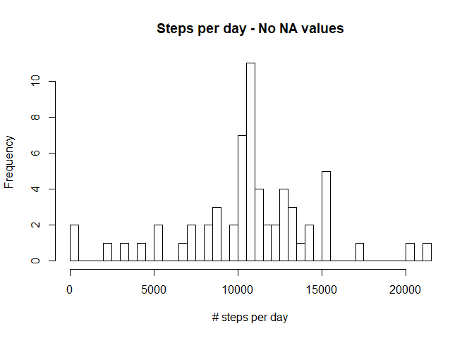

## Loading and preprocessing the data


```r
library(knitr)
library(dplyr)
```

```
## 
## Attaching package: 'dplyr'
```

```
## The following objects are masked from 'package:stats':
## 
##     filter, lag
```

```
## The following objects are masked from 'package:base':
## 
##     intersect, setdiff, setequal, union
```

```r
library(ggplot2)
furl<-"https://d396qusza40orc.cloudfront.net/repdata%2Fdata%2Factivity.zip"
download.file(furl,destfile = "amd.zip")
unzip("amd.zip")
amd<-read.csv("activity.csv")
```

## What is mean total number of steps taken per day?


```r
spd<-group_by(amd,date)
steps_per_day<-summarise(spd,steps_day=sum(steps,na.rm=TRUE))
Hist1<-hist(steps_per_day$steps_day, main="Steps per day", xlab="# steps per day",breaks=nrow(steps_per_day))
```

<!-- -->

```r
steps_mean<-mean(steps_per_day$steps_day,na.rm=TRUE)
steps_mean<-round(steps_mean,digits=2)
steps_median<-median(steps_per_day$steps_day,na.rm=TRUE)
```

The average number of steps taken each day is 9354.23.

The median number of steps taken each day is 10395.


## What is the average daily activity pattern?


```r
spi<-group_by(amd,interval)
steps_per_interval<-summarise(spi,steps_interval=mean(steps,na.rm=TRUE))
Steps_Inter_plot<-plot(steps_per_interval$interval, steps_per_interval$steps_interval, main="Average steps per interval",type="l", ylab="# steps per interval",xlab="Interval")
```

<!-- -->

```r
ordered_steps_interval<- steps_per_interval[order(-steps_per_interval$steps_interval),]
max_interval<-ordered_steps_interval[1,1]
```

The 5 minutes interval, considering the average of all days, containing the maximum number of steps is the interval 835.


## Imputing missing values


```r
comp_cases<-complete.cases(amd)
NA_rows<-nrow(amd)-sum(comp_cases)
amd_no_NA<-merge(amd,steps_per_interval,by="interval")
for(i in 1:nrow(amd)) {
  if(is.na(amd_no_NA[i,2])==TRUE) {
    amd_no_NA[i,2]<-amd_no_NA[i,4]
  }
}
```

The total number of rows with a missing value is 2304.

To solve the problem of the bias introduced by the `NA` missing values in the numbers of steps per interval, I replaced them with the average number of steps across all days for that specific interval. The new dataset with the replaced `NA` values is called `amd_no_NA`. Here you can find the histogram of the number of steps taken each day built with the new dataset.


```r
spd_no_NA<-group_by(amd_no_NA,date)
steps_per_day_no_NA<-summarise(spd_no_NA,steps_day=sum(steps))
Hist2<-hist(steps_per_day_no_NA$steps_day, main="Steps per day - No NA values", xlab="# steps per day",breaks=nrow(steps_per_day_no_NA))
```

<!-- -->

```r
steps_mean_no_NA<-mean(steps_per_day_no_NA$steps_day)
steps_mean_no_NA<-as.integer(round(steps_mean_no_NA,digits=0))
steps_median_no_NA<-median(steps_per_day_no_NA$steps_day)
steps_median_no_NA<-as.integer(round(steps_median_no_NA,digits=0))
```

Having replaced the missing `NA` values with the average of each interval, the average number of steps taken each day is 10766. The new median number of steps taken each day is 10766.


## Are there differences in activity patterns between weekdays and weekends?


```r
amd2<-amd_no_NA
amd2$day<-weekdays(as.Date(amd2$date))
for(i in 1:nrow(amd2)) {
  if(amd2[i,5]=="Saturday" | amd2[i,5]=="Sunday") {
    amd2[i,5]<-"Weekend" 
  }
  else {
    amd2[i,5]<-"Weekday"
  }
}
spi2<-group_by(amd2,interval,day)
steps_per_interval2<-summarise(spi2,steps_interval=mean(steps))
Wday_facet<-ggplot(steps_per_interval2,aes(x=interval,y=steps_interval))+geom_line()+facet_wrap(~steps_per_interval2$day,nrow=2)
print(Wday_facet)
```

<!-- -->
